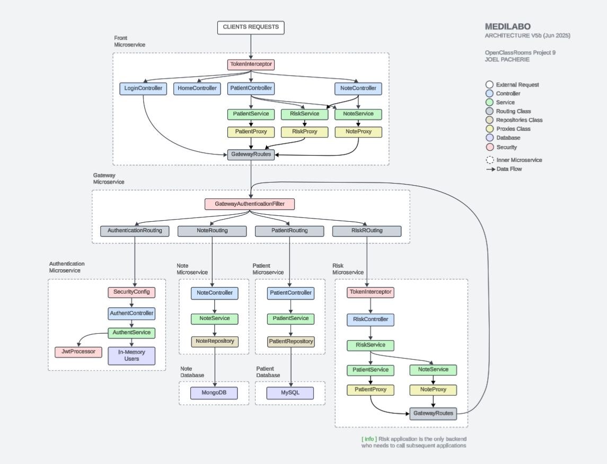

MEDILABO - Project 9
=========================================

To run the project locally:

  ☕ **Java-21** | **Maven** | **Docker-Desktop** must be installed on your system
  
  1) run the command 📱 "mvn clean install"
  2) run the command 📱 "docker-compose up --build"
  3) Access 🌎 **[http://localhost:18082/login](http://localhost:18082/login)**

🧭 Basic architecture presantation:

🌱 Green Coding Recommendations

1) 💾 Set up a caching system (in-memory) to avoid repeatedly calling back the database.
2) 🍃 Reduce the request size by sending back only the necessary object's fields instead of the entire object.
3) 🧱 Optimizing the database architecture.
