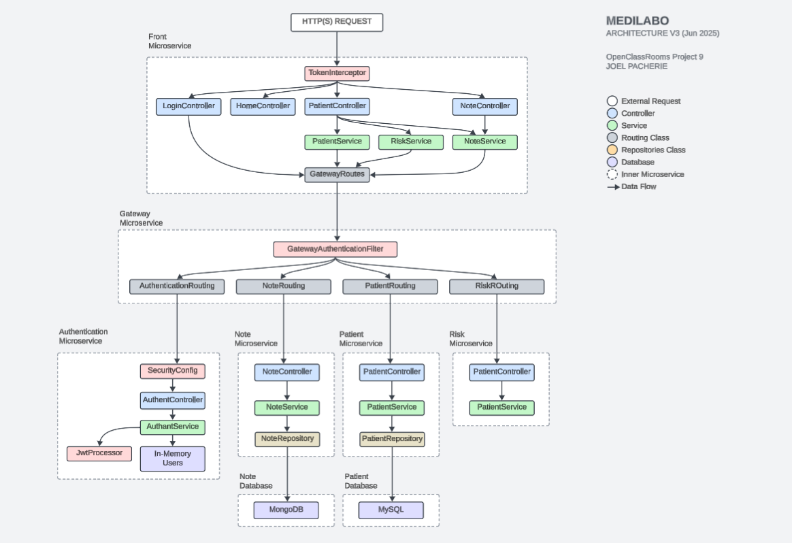

MEDILABO
=========================================

To run the project locally:

  **Java-21** | **Maven** | **Docker-Desktop** must be installed on your system
  
  1) run the command "mvn clean install"
  2) run the command "docker-compose up --build"
  3) Access **http://localhost:8080/**

Basic architecture presantation:

